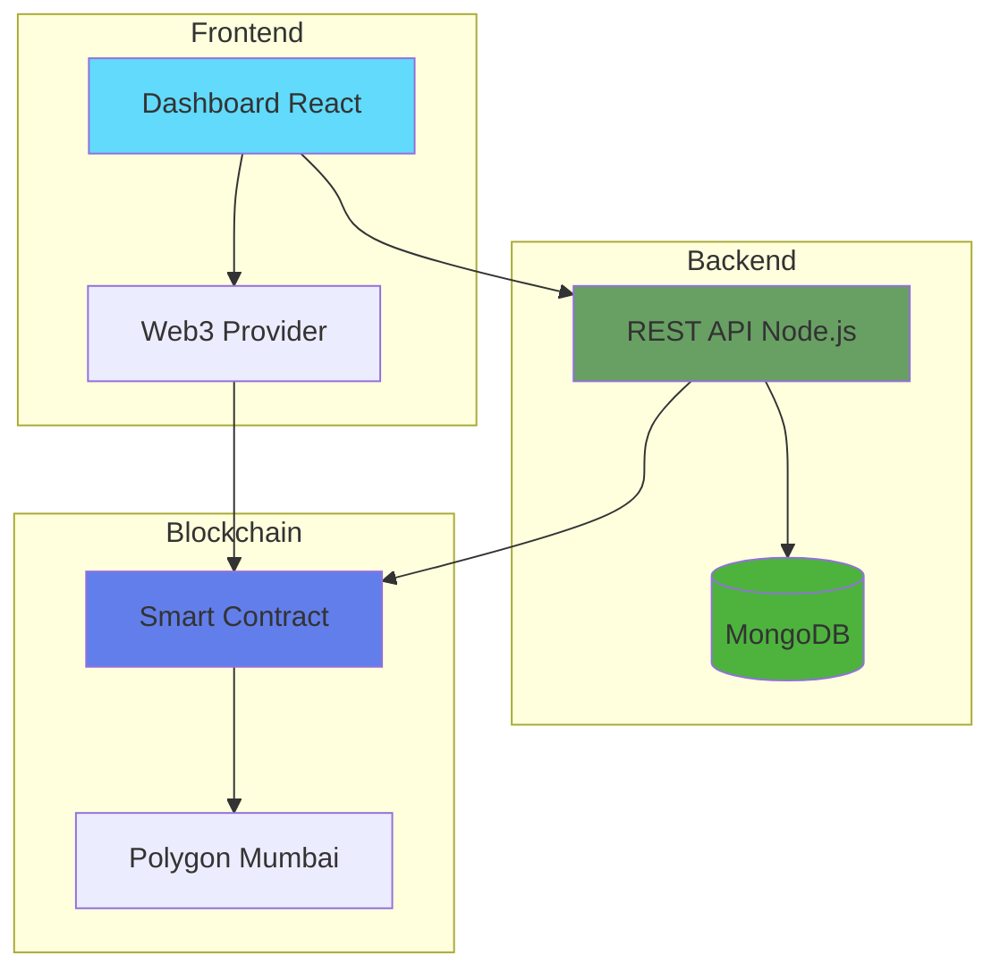
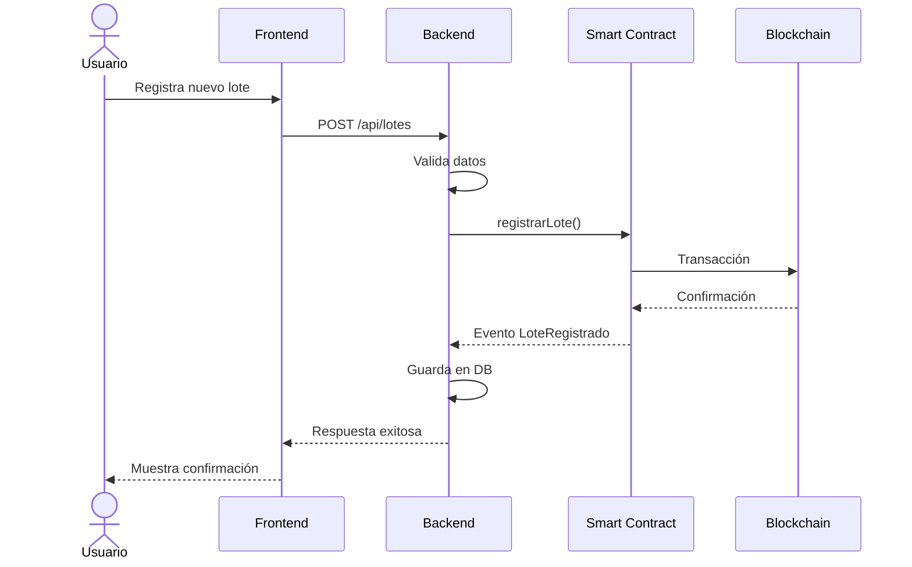
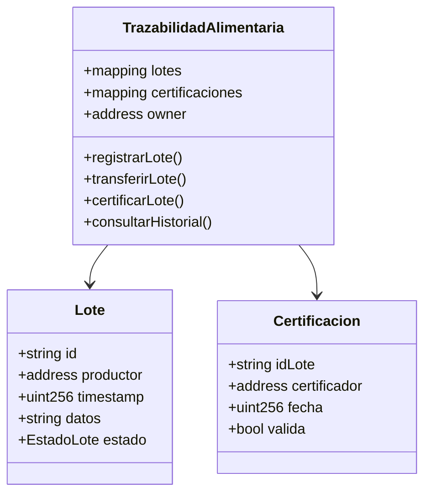
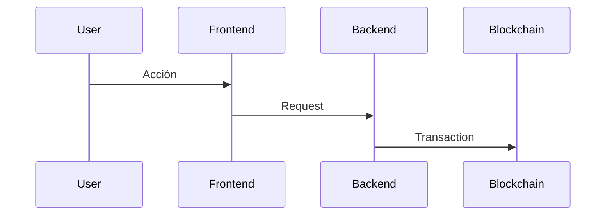

# Instrucciones Generales de Entrega - TFM

## Máster en Blockchain · Trabajo Final de Máster

---

## Índice

1. Resumen de Entregables
2. Código Fuente en GitHub
3. Video Demostración
4. Materiales Complementarios
5. Formato de Entrega
6. Plazos y Fechas
7. Criterios de Evaluación
8. Preguntas Frecuentes

---


## 1. Resumen de Entregables

Cada estudiante debe entregar **obligatoriamente** los siguientes elementos:

| **Entregable** | **Formato** | **Requisito** |
| --- | --- | --- |
| **Código fuente** | GitHub público | Repositorio completo |
| **Video demostración** | MP4/MOV o Loom | Máximo 5 minutos |
| **README técnico** | Markdown | En repositorio GitHub |
| **Capturas de pantalla** | PNG/JPG | Mínimo 5 capturas del dashboard |
| **Diagramas** | PNG/PDF/Mermaid | Arquitectura + flujo de datos |

---

## 2. Código Fuente en GitHub

### 2.1. Requisitos del Repositorio

El repositorio de GitHub debe ser **público** y contener:

✅ **Estructura obligatoria:**

```
nombre-proyecto-tfm/
├── README.md                    # Documentación principal
├── contracts/                   # Smart contracts
│   ├── TrazabilidadAlimentaria.sol
│   ├── migrations/
│   └── test/
├── backend/                     # Código del servidor
│   ├── src/
│   ├── package.json
│   └── .env.example
├── frontend/                    # Interfaz de usuario
│   ├── src/
│   ├── public/
│   └── package.json
├── docs/                        # Documentación adicional
│   ├── arquitectura.png
│   ├── diagrama-flujo.png
│   ├── diagramas.md            # Mermaid diagrams (recomendado)
│   └── manual-usuario.md
├── screenshots/                 # Capturas de pantalla
│   ├── dashboard-principal.png
│   ├── registro-lote.png
│   └── verificacion.png
├── LICENSE                      # Licencia MIT recomendada
└── .gitignore
```

### 2.2. Contenido del README.md

El archivo README.md debe incluir:

```markdown
# Nombre del Proyecto TFM
## DescripciónBreve descripción del proyecto (2-3 párrafos)
## Problema que ResuelveExplicar el problema del sector que se aborda
## Tecnologías Utilizadas- Blockchain: Polygon / Ethereum / BSV
- Smart Contracts: Solidity
- Backend: Node.js
- Frontend: React / HTML+JavaScript
- Base de datos: MongoDB / SQLite
- IA/Herramientas: Claude, MCP, ChatGPT, etc. (si aplica)
## Arquitectura del Sistema
[Incluir diagrama de arquitectura]
## Instalación y Configuración### Requisitos Previos- Node.js v18+
- npm o yarn
- MetaMask instalado
- Cuenta en Infura/Alchemy (para testnet)
### Instalación de Dependencias
# Instalar dependencias del backendcd backend
npm install
# Instalar dependencias del frontendcd frontend
npm install
# Compilar smart contractscd contracts
truffle compile
### Configuración
1. Copiar `.env.example` a `.env`
2. Configurar variables de entorno
3. Desplegar smart contracts en testnet
### Ejecución# Backendcd backend
npm start
# Frontendcd frontend
npm start
## Smart Contracts Desplegados- Red: Polygon Mumbai Testnet
- Contrato Principal: 0x742d35Cc6634C0532925a3b844Bc9e7595f0bEb0
- Explorador: [PolygonScan](https://mumbai.polygonscan.com/address/0x742d...)
## Casos de Uso1. Registro de lote alimentario
2. Transferencia entre actores
3. Verificación de certificados
4. Consulta de trazabilidad
## Capturas de Pantalla
[Ver carpeta /screenshots]
## Diagramas Técnicos
[Ver documentación de diagramas](docs/diagramas.md)
## Video Demostración
🎥 [Ver video](https://www.loom.com/share/...)
## Innovaciones Implementadas
- [Describe qué aspectos mejoraste respecto al esqueleto base]
- [Funcionalidades adicionales que agregaste]
- [Uso de IA/MCP si aplica]
## Uso de Herramientas de IA
[Si usaste Claude MCP, ChatGPT u otras herramientas de IA, descríbelo aquí]
## Autor
- **Nombre:** [Tu nombre]
- **Email:** [tu-email@example.com]
- **LinkedIn:** [tu-perfil]
## LicenciaMIT License
```

### 2.3. Buenas Prácticas de Código

✅ **Hacer:**
- Comentar funciones importantes
- Usar nombres descriptivos de variables
- Incluir tests unitarios (mínimo 5)
- Documentar funciones de smart contracts con NatSpec
- Usar .gitignore para archivos sensibles

❌ **No hacer:**
- Subir claves privadas o seeds
- Incluir archivos `.env` con credenciales
- Dejar código comentado sin usar
- Subir node_modules o archivos compilados

### 2.4. Commits y Versionado

- Realizar commits frecuentes y descriptivos
- Usar mensajes claros: `feat: añadir registro de lotes`, `fix: corregir verificación de hash`
- Mantener historial limpio y organizado

---

## 3. Video Demostración

### 3.1. Requisitos Técnicos

| **Aspecto** | **Requisito** |
| --- | --- |
| **Duración** | Máximo 5 minutos (estricto) |
| **Formato** | MP4, MOV o enlace Loom |
| **Resolución** | Mínimo 1280x720 (720p) |
| **Audio** | Voz clara y audible |
| **Idioma** | Español (se acepta inglés) |
| **Plataforma** | Loom (recomendado) / YouTube / Vimeo |

### 3.2. Herramienta Recomendada: Loom

**¿Por qué Loom?**

✅ **Ventajas:**
- **Gratis** para videos de hasta 5 minutos
- **Muy fácil de usar** - graba en 1 clic
- **No requiere edición** - listo al terminar de grabar
- **Genera enlace automático** - fácil de compartir
- **Graba pantalla + cámara** simultáneamente (opcional)
- **Se puede ver sin descargar** - el profesor accede directamente
- **Elimina presión de edición** - enfócate en el contenido

**Cómo usar Loom:**

1. **Registrarse:**
    - Ir a [https://www.loom.com](https://www.loom.com/)
    - Crear cuenta gratuita (con email o Google)
2. **Instalar extensión:**
    - Descargar extensión de Chrome/Edge/Firefox
    - O usar aplicación de escritorio
3. **Grabar:**
    - Clic en icono de Loom
    - Elegir “Screen + Cam” o “Screen Only”
    - Seleccionar qué pantalla/ventana grabar
    - Clic en “Start Recording”
    - Cuenta regresiva 3-2-1 y empiezas
    - **Importante:** Loom muestra timer, vigila no pasar de 5 min
4. **Finalizar:**
    - Clic en “Stop Recording”
    - Video se procesa automáticamente
    - Copiar enlace generado
5. **Compartir:**
    - Configurar como “Anyone with the link”
    - Copiar URL
    - Pegar en README.md y email de entrega

**Alternativas a Loom:**
- **OBS Studio** (gratuito, más técnico)
- **YouTube** (público o no listado)
- **Vimeo** (plan gratuito limitado)

.png)

### 3.3. Estructura Recomendada del Video

**Minuto 0:00-0:30 - Introducción**
- Presentación breve (nombre + proyecto)
- Problema que resuelve tu solución
- Proyecto de referencia (GrainChain/SUKU/TimberChain/Blockcerts/Power Ledger)
- **IMPORTANTE:** Menciona qué innovaciones agregaste vs el esqueleto base

**Minuto 0:30-1:30 - Explicación Técnica**
- Arquitectura del sistema (mostrar diagrama)
- Tecnologías utilizadas
- Smart contracts principales
- **DESTACAR:** Funcionalidades únicas que implementaste

**Minuto 1:30-4:00 - Demostración Práctica**
- Navegar por el dashboard
- Ejecutar caso de uso principal (ej: registrar lote)
- Mostrar transacción en blockchain (explorer)
- Verificar datos on-chain
- Demostrar funcionalidad clave del MVP
- **Mostrar características innovadoras o diferentes del esqueleto**

**Minuto 4:00-5:00 - Conclusiones**
- Resultados obtenidos
- Lecciones aprendidas
- Posibles mejoras futuras
- **Valor agregado de tu implementación**

### 3.4. Consejos para Grabar

✅ **Recomendaciones:**
- **Ensayar antes** - hacer 1-2 pruebas previas
- **Cerrar pestañas innecesarias** - solo lo que vas a mostrar
- **Usar micrófono de calidad** - evitar ruido ambiente
- **Grabar en lugar tranquilo** - sin interrupciones
- **Tener guion mental** - no leer, pero saber qué mostrar
- **Mostrar código solo si es relevante** - no leer línea por línea
- **Enfocarse en la DEMOSTRACIÓN** - hacer, no explicar teoría
- **Probar todo ANTES de grabar** - que funcione el MVP
- **Vigilar el tiempo** - Loom muestra contador en vivo
- **Destacar tus innovaciones** - qué hace único tu proyecto

❌ **Evitar:**
- Leer documentación en el video
- Grabar con teléfono móvil apuntando a la pantalla
- Audio inaudible o con mucho ruido
- Video que exceda los 5 minutos
- Mostrar información sensible (claves privadas, emails personales)
- Navegar sin rumbo - tener secuencia clara
- Quedarse en silencio mientras cargan cosas

### 3.5. Checklist antes de Grabar

Antes de presionar “Record” en Loom, verifica:

- [ ]  Dashboard funcionando correctamente
- [ ]  Metamask conectada a testnet correcta
- [ ]  Datos de prueba preparados
- [ ]  Transacción de ejemplo lista para ejecutar
- [ ]  Blockchain explorer abierto en otra pestaña
- [ ]  Diagrama de arquitectura visible
- [ ]  Micrófono probado y funcionando
- [ ]  Lugar tranquilo sin ruido
- [ ]  Guion mental preparado
- [ ]  Tiempo estimado: ~4:30 minutos
- [ ]  Lista de innovaciones a mencionar

### 3.6. Cómo Compartir el Video

**Si usas Loom:**

```markdown
## Video Demostración
🎥 [Ver demostración completa en Loom](https://www.loom.com/share/abc123xyz)
```

**Si usas YouTube:**

```markdown
## Video Demostración
🎥 [Ver demostración en YouTube](https://www.youtube.com/watch?v=abc123)
```

**Incluir enlace en:**
- README.md del repositorio GitHub (sección destacada)
- Email de entrega
- Verificar que el enlace funciona ANTES de enviar

---

## 4. Materiales Complementarios

### 4.1. Capturas de Pantalla

Incluir **mínimo 5 capturas** del sistema funcionando:

1. **Dashboard principal** - vista general del sistema
2. **Formulario de registro** - creando lote/envío/certificado
3. **Visualización de datos** - timeline, gráficas, mapas
4. **Transacción confirmada** - en blockchain explorer
5. **Verificación exitosa** - de certificado/trazabilidad

**Formato:**
- PNG o JPG de alta calidad
- Resolución clara y legible
- Incluir en carpeta `/screenshots` del repositorio
- Nombrar descriptivamente: `01-dashboard-principal.png`, `02-registro-lote.png`

**Herramientas recomendadas:**
- Windows: Snipping Tool / Win+Shift+S
- Mac: Cmd+Shift+4
- Extensión navegador: Awesome Screenshot

4.2. Diagramas Obligatorios

.png)

**Diagrama de Arquitectura:**
- Componentes del sistema (frontend, backend, blockchain, base de datos)
- Flujo de información entre componentes
- Tecnologías utilizadas en cada capa

**Diagrama de Flujo de Datos:**
- Proceso completo de un caso de uso principal
- Interacción con smart contracts
- Estados del sistema

### 🎯 **Mermaid: Herramienta Recomendada para Diagramas**

**¿Por qué Mermaid?**

✅ **Ventajas:**
- **Diagramas como código** - fácil de versionar en Git
- **Renderizado automático** - GitHub los muestra directamente
- **Totalmente gratuito** - sin necesidad de cuentas
- **Fácil de modificar** - solo editas texto
- **Múltiples tipos** - flowcharts, sequence diagrams, class diagrams, etc.
- **Integración perfecta** - funciona en Markdown

**📚 Documentación y Tutoriales de Mermaid:**

- **Documentación oficial:** [https://mermaid.js.org/intro/](https://mermaid.js.org/intro/)
- **Sintaxis de diagramas de flujo:** [https://mermaid.js.org/syntax/flowchart.html](https://mermaid.js.org/syntax/flowchart.html)
- **Diagramas de secuencia:** [https://mermaid.js.org/syntax/sequenceDiagram.html](https://mermaid.js.org/syntax/sequenceDiagram.html)
- **Editor online (Live Editor):** [https://mermaid.live/](https://mermaid.live/)
- **Tutorial interactivo:** [https://mermaid.js.org/config/Tutorials.html](https://mermaid.js.org/config/Tutorials.html)
- **Galería de ejemplos:** [https://mermaid.js.org/ecosystem/integrations.html](https://mermaid.js.org/ecosystem/integrations.html)

**Ejemplo 1: Diagrama de Arquitectura con Mermaid**



**Ejemplo 2: Diagrama de Flujo de Proceso**



**Ejemplo 3: Diagrama de Clases de Smart Contract**



**Cómo incluir Mermaid en tu README.md:**

```markdown
## Arquitectura del Sistema```mermaidgraph TB    Frontend --> Backend    Backend --> Blockchain    Backend --> Database
```

### Flujo de Datos



**Cómo crear diagramas Mermaid:**

1. **Opción 1: Editor Online**
    - Ve a [https://mermaid.live/](https://mermaid.live/)
    - Escribe tu diagrama usando sintaxis Mermaid
    - Ve el preview en tiempo real
    - Exporta como PNG si quieres imagen estática
    - Copia el código al README.md
2. **Opción 2: Directo en GitHub**
    - Crea bloque de código con ````mermaid`
    - Escribe tu diagrama
    - GitHub lo renderiza automáticamente
3. **Opción 3: VS Code**
    - Instala extensión “Markdown Preview Mermaid Support”
    - Escribe diagramas con preview en tiempo real

**Otras herramientas (alternativas):**
- [Draw.io](https://app.diagrams.net/) - si prefieres interfaz gráfica
- [Excalidraw](https://excalidraw.com/) - estilo boceto a mano
- Lucidchart - versión gratuita limitada

**Formato:**
- **Preferido:** Código Mermaid en `docs/diagramas.md`
- **Alternativo:** PNG de alta resolución / PDF vectorial
- Incluir en carpeta `/docs` del repositorio

**Ejemplo de estructura en `docs/diagramas.md`:**

# Diagramas Técnicos del Proyecto

## 1. Arquitectura del Sistema

```mermaid
[tu diagrama aquí]
```

## 2. Flujo de Registro de Lote

```mermaid
[tu diagrama aquí]
```

## 3. Modelo de Datos

```mermaid
[tu diagrama aquí]
```

---

## 5. Formato de Entrega

### 5.1. Método de Entrega

Uso de la aplicación: [App Proyectos](https://proyectos.codecrypto.jvh.kfs.es/)

### 5.2. Verificación antes de Enviar

**Antes de presionar “Enviar”, verifica:**

✅ **GitHub:**
- [ ] Repositorio es público (no privado)
- [ ] README.md renderiza correctamente
- [ ] Diagramas Mermaid se visualizan en GitHub
- [ ] Enlaces en README funcionan
- [ ] Código se ve organizado
- [ ] Screenshots son visibles

✅ **Video:**
- [ ] Enlace funciona (pruébalo en navegador incógnito)
- [ ] Configurado como “Anyone with the link can view”
- [ ] Duración no excede 5 minutos
- [ ] Audio es audible
- [ ] Se mencionan innovaciones vs esqueleto base

✅ **Smart Contracts:**
- [ ] Desplegado en testnet
- [ ] Address visible en blockchain explorer
- [ ] Transacciones se pueden ver públicamente

---

## 6. Plazos y Fechas

### 6.1. Calendario de Entregas

| **Hito** | **Fecha** | **Entregable** |
| --- | --- | --- |
| **Avance 1** | Semana 1 | Diseño de arquitectura + smart contracts iniciales |
| **Avance 2** | Semana 3 | MVP funcional básico + código en GitHub |
| **Entrega final** | Semana 1 | Todos los entregables completos |

### 6.2. Penalizaciones por Retraso

- **1 día de retraso:** -10% de la nota final
- **2-3 días de retraso:** -20% de la nota final
- **Más de 3 días:** No se acepta la entrega

---

.png)

## 7. Criterios de Evaluación

### 7.1. Distribución de Puntos

| **Criterio** | **Peso** | **Descripción** |
| --- | --- | --- |
| **Código fuente** | 30% | Funcionalidad, calidad, documentación |
| **Smart contracts** | 25% | Diseño, seguridad, eventos |
| **Video demostración** | 15% | Claridad, demostración práctica |
| **Documentación** | 10% | README, diagramas, comentarios |
| **Innovación y originalidad** | 15% | Diferenciación del esqueleto, creatividad |
| **Uso de IA/MCP** | 5% | Integración de herramientas de IA |

### 7.2. Rúbrica Detallada

**Código fuente (30%):**
- Funcionalidad completa del MVP (12%)
- Código limpio y bien estructurado (8%)
- Tests implementados (5%)
- README completo y profesional (5%)

**Smart contracts (25%):**
- Funciones implementadas correctamente (10%)
- Eventos bien diseñados (6%)
- Consideraciones de seguridad (5%)
- Documentación NatSpec (4%)

**Video demostración (15%):**
- Demostración práctica efectiva (7%)
- Explicación clara y concisa (5%)
- Calidad técnica (audio/video) (3%)

**Documentación (10%):**
- Diagramas de arquitectura con Mermaid (4%)
- Comentarios en código (3%)
- Capturas de pantalla (3%)

**Innovación y originalidad (15%):**
- **Diferenciación del esqueleto base (8%)**
- No es copia directa del proyecto guía
- Implementa funcionalidades adicionales
- Mejora el diseño o arquitectura propuesta
- Agrega valor real al sector elegido
- **Creatividad en la solución (4%)**
- Abordaje innovador del problema
- UX/UI mejorado
- Optimizaciones técnicas
- **Aportación de valor (3%)**
- Utilidad real del proyecto
- Escalabilidad de la solución

**Uso de IA/MCP (5%):**
- **Integración de Model Context Protocol (3%)**
- Uso documentado de MCP servers
- Implementación de herramientas MCP personalizadas
- Demostración de workflows con IA
- **Otras herramientas de IA (2%)**
- Uso de Claude, ChatGPT, Copilot, etc.
- Documentación de cómo se usó la IA
- Comprensión del código generado

---

## 8. Esqueleto Base y Expectativas de Innovación

### 🎯 **Sobre el Proyecto Esqueleto**

Se proporcionará un **esqueleto base de proyecto** que servirá como punto de partida y guía. Sin embargo:

⚠️ **IMPORTANTE:**
- El esqueleto es una **GUÍA**, no una plantilla para copiar
- Se espera que **innoves y agregues valor** sobre esta base
- **NO se premiará la copia directa** del esqueleto
- **SÍ se premiará** la originalidad y creatividad

### ✅ **Qué se espera de ti:**

1. **Usar el esqueleto como referencia** para:
    - Entender la estructura básica
    - Ver ejemplos de buenas prácticas
    - Aprender patrones de implementación
2. **Agregar tu toque personal:**
    - Implementa funcionalidades adicionales
    - Mejora el diseño de la UI/UX
    - Optimiza el código
    - Agrega features innovadoras
    - Personaliza para tu sector específico
3. **Diferenciarte del esqueleto:**
    - Usa una arquitectura diferente si tiene sentido
    - Implementa smart contracts con lógica propia
    - Crea un dashboard único y personalizado
    - Agrega integraciones con otras APIs o servicios

### 💡 **Ideas para innovar:**

**Frontend:**
- Dashboard personalizado con gráficas y visualizaciones únicas
- Animaciones y transiciones mejoradas
- Diseño responsive optimizado
- Temas personalizados (dark mode, etc.)
- Mapas interactivos de trazabilidad
- Notificaciones en tiempo real

**Backend:**
- APIs RESTful optimizadas
- WebSockets para actualizaciones en tiempo real
- Cacheo inteligente
- Sistema de alertas automatizado
- Integración con servicios externos (IPFS, Oracles, etc.)

**Smart Contracts:**
- Lógica de negocio específica de tu sector
- Optimizaciones de gas
- Upgradability patterns
- Multi-signature para mayor seguridad
- Eventos personalizados y ricos en datos

**Uso de IA/MCP:**
- Generación automática de reportes con IA
- Análisis predictivo de datos
- Chatbot integrado para consultas
- Automatización de workflows con MCP
- Validación de datos con modelos de ML

### 🏆 **Proyectos destacados tendrán:**

- Implementación clara de features no presentes en el esqueleto
- Documentación de qué se agregó/mejoró
- Justificación técnica de las decisiones tomadas
- Demostración en el video de las innovaciones
- README que explica el valor agregado

### ⚠️ **Proyectos que obtendrán nota baja:**

- Copia exacta del esqueleto con solo cambios de nombres
- Sin funcionalidades adicionales o mejoras
- UI/UX idéntica sin personalización
- No hay documentación de innovaciones
- Video que no menciona diferencias con el esqueleto

---

## 9. Model Context Protocol (MCP) y Herramientas de IA

### 🤖 **¿Qué es Model Context Protocol (MCP)?**

MCP es un protocolo abierto desarrollado por Anthropic que permite a Claude (y otros modelos de IA) interactuar con herramientas externas, bases de datos y sistemas de forma estandarizada.

**Documentación oficial de MCP:**
- **Web oficial:** [https://modelcontextprotocol.io](https://modelcontextprotocol.io/)
- **Repositorio GitHub:** [https://github.com/modelcontextprotocol](https://github.com/modelcontextprotocol)
- **Especificación:** [https://spec.modelcontextprotocol.io](https://spec.modelcontextprotocol.io/)
- **Guías de implementación:** [https://modelcontextprotocol.io/docs](https://modelcontextprotocol.io/docs)

### 💡 **Cómo usar MCP en tu TFM**

**Casos de uso potenciales:**

1. **Automatización con IA:**
    - Usar Claude Code o Claude Desktop con MCP para automatizar tareas de desarrollo
    - Generar smart contracts con asistencia de IA
    - Análisis automático de código
2. **Integraciones:**
    - Crear MCP servers personalizados para tu blockchain
    - Conectar tu dashboard con Claude para consultas en lenguaje natural
    - Automatizar pruebas y despliegues
3. **Análisis de datos:**
    - Procesar datos on-chain con IA
    - Generar reportes automáticos
    - Detectar anomalías o patrones

**Ejemplos de implementación:**

```jsx
// Ejemplo: MCP Server personalizado para consultar blockchainimport { Server } from "@modelcontextprotocol/sdk/server/index.js";import { Web3 } from "web3";const server = new Server({
  name: "blockchain-query-server",  version: "1.0.0"});// Herramienta para consultar balanceserver.setRequestHandler("tools/call", async (request) => {
  if (request.params.name === "get_balance") {
    const web3 = new Web3("https://polygon-rpc.com");    const balance = await web3.eth.getBalance(request.params.arguments.address);    return { balance: balance.toString() };  }
});
```

### 📚 **Recursos de Aprendizaje de MCP:**

**Tutoriales:**
- Tutorial oficial: [https://modelcontextprotocol.io/quickstart](https://modelcontextprotocol.io/quickstart)
- Ejemplos de MCP servers: [https://github.com/modelcontextprotocol/servers](https://github.com/modelcontextprotocol/servers)
- Guía de TypeScript SDK: [https://modelcontextprotocol.io/docs/typescript-sdk](https://modelcontextprotocol.io/docs/typescript-sdk)

**Videos:**
- Canal de Anthropic en YouTube: [https://www.youtube.com/@Anthropic-AI](https://www.youtube.com/@Anthropic-AI)
- Buscar: “Model Context Protocol tutorial”

**Comunidad:**
- Discord de Anthropic: [https://discord.gg/anthropic](https://discord.gg/anthropic)
- GitHub Discussions: [https://github.com/modelcontextprotocol/servers/discussions](https://github.com/modelcontextprotocol/servers/discussions)

**Videos Academia**
…

### 🎯 **Cómo se evaluará el uso de IA/MCP:**

**Puntos extras (5% del total):**

✅ **Se premia:**
- Documentar en README cómo se usó IA (qué herramientas, para qué)
- Implementar MCP servers o integraciones
- Usar Claude Code para desarrollo
- Demostrar comprensión del código generado por IA
- Agregar valor real con IA (no solo copy-paste)

📝 **Qué documentar:**

## Uso de Herramientas de IA

### Ejemplo: Claude MCP

- **MCP Server:** Desarrollé un servidor MCP personalizado para consultar datos on-chain
- **Ubicación:** `/mcp-server/blockchain-query.ts`
- **Funcionalidad:** Permite consultas en lenguaje natural a la blockchain

### ChatGPT/Claude

- Asistencia en generación de smart contracts base
- Debugging de errores complejos
- Optimización de queries a la base de datos

### Comprensión

Todo el código generado fue revisado, entendido y adaptado
a las necesidades específicas del proyecto.

❌ **No se premia:**
- Uso de IA sin documentar
- Copy-paste de código sin entender
- No poder explicar el código en el video

---

## 10. Preguntas Frecuentes

### ¿Puedo usar código de librerías open source?

**Sí**, pero debes:
- Citar la fuente en el código
- Incluir la licencia correspondiente
- Explicar en el README qué código es propio y cuál es reutilizado

### ¿Debo desplegar en mainnet o testnet?

**Testnet es suficiente** (recomendado: Polygon Mumbai, Sepolia, BSV testnet). Mainnet es opcional pero NO necesario.

### ¿Qué pasa si mi código no funciona perfectamente?

Lo importante es que demuestres comprensión del problema y la solución. **Documenta las limitaciones** en tu README. Un MVP con limitaciones bien explicadas es mejor que uno “perfecto” sin justificación.

### ¿Puedo trabajar en grupo?

**No**, el TFM es individual. Cada estudiante debe entregar su propio proyecto.

### ¿Puedo usar ChatGPT o IA para el código?

**Sí**, y de hecho se premia su uso documentado. Pero debes:
- Comprender todo el código que entregas
- Ser capaz de explicarlo en el video
- Indicar en el README cómo usaste IA

### ¿El esqueleto base es obligatorio de usar?

**No es obligatorio**, pero es muy recomendado como punto de partida. Lo importante es que **agregues valor e innoves** sobre cualquier base que uses.

### ¿Qué pasa si mi proyecto es muy similar al esqueleto?

Obtendrás una **nota más baja** en la sección de “Innovación” (15% del total). Para obtener buena nota, debes demostrar que agregaste valor, funcionalidades únicas, o mejoras significativas.

### ¿Qué blockchain debo usar?

**Recomendado:** Cualquier red EVM (Ethereum, Polygon, BSV, Avalanche, etc.). Lo importante es que justifiques tu elección en el README.

### ¿Es obligatorio el video?

**Sí**, es uno de los entregables obligatorios. Sin video, el TFM está incompleto.

### ¿Tengo que usar Loom obligatoriamente?

**No**, pero es muy recomendado por su facilidad. Alternativas válidas: YouTube, Vimeo, OBS+upload.

### ¿Es obligatorio usar Mermaid para los diagramas?

**No es obligatorio**, pero es **altamente recomendado** porque:
- Se versionan fácilmente en Git
- GitHub los renderiza automáticamente
- Son fáciles de modificar
- Demuestran conocimiento de herramientas modernas

Alternativas válidas: Draw.io, Excalidraw, o imágenes PNG/PDF.

### ¿Puedo grabar el video con mi voz en off?

**Sí**, lo importante es que se escuche claramente. No es necesario aparecer en cámara.

### ¿Necesito base de datos?

**Recomendado** para indexar datos de blockchain y mejorar rendimiento del dashboard, pero no es estrictamente obligatorio si tu MVP es simple.

### ¿Cuántos smart contracts debo tener?

**Mínimo 1 contrato principal** con al menos 5 eventos relevantes y 5 funciones. Puedes tener más si tu arquitectura lo requiere.

### ¿Qué hago si Loom me limita los 5 minutos?

La versión gratuita de Loom permite videos de hasta 5 minutos, perfecto para este TFM. Si necesitas más tiempo, considera usar YouTube o editar para ser más conciso.

### ¿Puedo compartir el video como “privado”?

**No**, debe ser al menos “Anyone with the link” en Loom o “No listado” en YouTube. El profesor necesita acceso directo con el enlace.

### ¿Cómo documento el uso de Model Context Protocol?

Crea una sección en tu README:

```markdown
## Integración con Model Context Protocol
### MCP Servers implementados
- [Nombre del server]: [Descripción y funcionalidad]
- [Código en]: `/mcp-servers/`
### Casos de uso- [Describe cómo usas MCP en tu proyecto]
```

### ¿Debo saber TypeScript para usar MCP?

**No es obligatorio**, pero el SDK oficial de MCP está en TypeScript. Puedes usar JavaScript puro.

### ¿Qué pasa si no uso MCP?

**No hay problema**, el uso de MCP es **opcional** y solo otorga **puntos extras** (5%). Puedes obtener una excelente nota sin usarlo si tu proyecto es innovador en otros aspectos.

---

.png)

## 11. Checklist Final antes de Entregar

Antes de enviar tu TFM, verifica que cumples con **TODOS** estos puntos:

### Repositorio GitHub

- [ ]  Repositorio público y accesible
- [ ]  README.md completo y bien formateado
- [ ]  Código fuente organizado en carpetas
- [ ]  Smart contracts documentados
- [ ]  .gitignore configurado (sin claves privadas)
- [ ]  LICENSE incluido (MIT recomendada)
- [ ]  Screenshots en carpeta `/screenshots` (mínimo 5)
- [ ]  Diagramas en carpeta `/docs` (Mermaid preferido)
- [ ]  Sección de innovaciones en README
- [ ]  Documentación de uso de IA si aplica

### Smart Contracts

- [ ]  Compilado sin errores
- [ ]  Desplegado en testnet
- [ ]  Address del contrato documentado en README
- [ ]  Visible en blockchain explorer
- [ ]  Eventos implementados (mínimo 5)
- [ ]  Funciones principales implementadas
- [ ]  Comentarios NatSpec en funciones públicas

### Video

- [ ]  Duración máxima 5 minutos
- [ ]  Audio claro y audible
- [ ]  Demostración práctica del MVP funcionando
- [ ]  Mención de innovaciones vs esqueleto base
- [ ]  Subido a Loom/YouTube/Vimeo
- [ ]  Enlace funcional y público
- [ ]  Enlace incluido en README

### Materiales Complementarios

- [ ]  Mínimo 5 capturas de pantalla de calidad
- [ ]  Diagrama de arquitectura (Mermaid preferido)
- [ ]  Diagrama de flujo de datos
- [ ]  Transacción visible en blockchain explorer

### Innovación

- [ ]  Proyecto se diferencia claramente del esqueleto base
- [ ]  Funcionalidades adicionales implementadas
- [ ]  Documentación de qué se agregó/mejoró
- [ ]  Justificación técnica en README

### IA/MCP (Opcional pero premiado)

- [ ]  Uso de IA documentado en README
- [ ]  Código generado comprendido y explicable
- [ ]  Integración de MCP si aplica
- [ ]  Valor agregado con IA demostrable

### App de Entrega

- [ ]  Todos los enlaces incluidos
- [ ]  Enlaces verificados y funcionales
- [ ]  Mención de innovaciones implementadas
- [ ]  Enviado antes del deadline
- [ ]  Checklist de entregables incluida

---

## 12. Recursos Útiles

### Herramientas Recomendadas

**Para grabar video:**
- 🎥 [Loom](https://www.loom.com/) - Gratis, súper fácil
- 📹 [OBS Studio](https://obsproject.com/) - Gratuito, profesional
- ▶️ YouTube - Para subir y compartir

**Para diagramas:**
- 🎯 [**Mermaid](https://mermaid.js.org/) - RECOMENDADO**
- [Editor en vivo](https://mermaid.live/)
- [Documentación completa](https://mermaid.js.org/intro/)
- [Tutorial de flowcharts](https://mermaid.js.org/syntax/flowchart.html)
- [Ejemplos de sequence diagrams](https://mermaid.js.org/syntax/sequenceDiagram.html)
- ✏️ [Draw.io](https://app.diagrams.net/) - Alternativa gráfica
- 🎨 [Excalidraw](https://excalidraw.com/) - Estilo boceto

**Para capturas:**
- Windows: Win+Shift+S
- Mac: Cmd+Shift+4
- Extensión: [Awesome Screenshot](https://www.awesomescreenshot.com/)

**Para testnet:**
- 🟣 [Polygon Mumbai Faucet](https://faucet.polygon.technology/)
- 🔵 [Sepolia Faucet](https://sepoliafaucet.com/)
- 🌐 [PolygonScan Mumbai](https://mumbai.polygonscan.com/)

**Para Model Context Protocol:**
- 🤖 [MCP Official Website](https://modelcontextprotocol.io/)
- 📚 [MCP Documentation](https://modelcontextprotocol.io/docs)
- 🛠️ [MCP GitHub](https://github.com/modelcontextprotocol)
- 💬 [MCP Discord](https://discord.gg/anthropic)

**Para IA generativa:**
- 🧠 [Claude](https://claude.ai/) - Para código y análisis
- 💬 [ChatGPT](https://chat.openai.com/) - Alternativa
- 👨‍💻 [GitHub Copilot](https://github.com/features/copilot) - En IDE

---

## Contacto y Soporte

**Dudas técnicas:**
?

**Dudas administrativas:**
?

**Horario de consultas:**
?

---

**¡Mucho éxito con tu Trabajo Final de Máster!** 🚀

*Recuerda: Un buen video vale más que mil palabras. Demuestra lo que construiste y cómo innovaste sobre el esqueleto base.*

*El uso de herramientas modernas como Mermaid y MCP demostrará que estás al día con las mejores prácticas de la industria.*